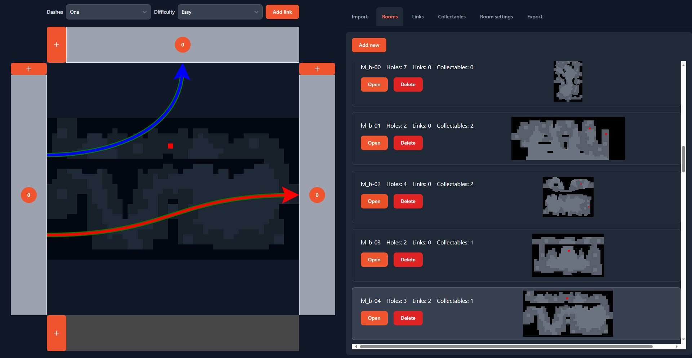

# Celeste randomizer helper

Application for fast creation of yaml configurations for [Celeste Randomizer](https://github.com/rhelmot/CelesteRandomizer) in the graphical interface.

# Creating and editing configurations

Loenn map data and an existing yaml configuration can be loaded to create the configuration. 
- To load Loenn map data, you need to use [Loenn script](Loenn/copyMap.lua). This will allow the application to automatically place holes in rooms and read other information.
- Currently the application supports only loading yaml configurations made in Celeste randomizer helper. yaml configuration can be not loaded to create a new configuration from scratch.

Next, you need to set up the rooms and make connections between entrances and exits. Links can be made if you set the hole as initial or final, in the menu that opens when you hover the mouse over the hole. Holes that do not participate in links are considered unreachable.

Once the map is configured it can be exported to yaml.

# Development plans

In the future it is planned to add all functionality that can be in yaml configurations and improve visualization of rooms.
